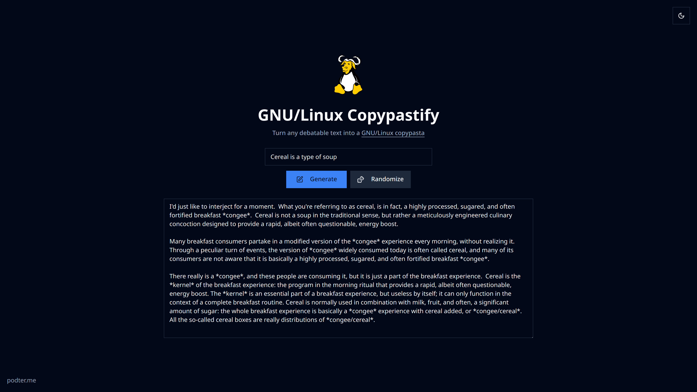

# GNU/Linux Copypastify



An app that turn any debatable text into a
[GNU/Linux copypasta](https://www.gnu.org/gnu/incorrect-quotation.en.html#:~:text=I%27d%20just%20like,system%20they%20use.)
with AI.

Built with SvelteKit, Tailwind CSS, Vercel AI SDK, and Gemini.

## Developing

Once you've cloned the repo and installed dependencies with `bun install`, start a development server:

```bash
bun dev

# or start the server and open the app in a new browser tab
bun dev --open
```

## Building

To create a production version of your app:

```bash
bun run build
```

You can preview the production build with `bun preview`.
